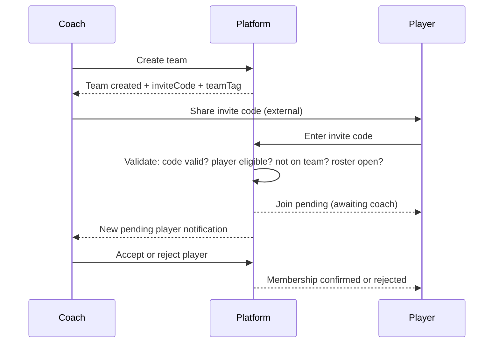

# Dtached Platform Logic Plan

> **Core Principle:** A player exists independently. A team exists independently. Team membership is a controlled relationship managed by the coach, not by the player.

---

## 1. Entity Identity

### Current State

| Entity | Permanent Tag? | Notes |
|--------|---------------|-------|
| **Player** | ❌ No `playerTag` | Identified by DB `id` only |
| **Team** | ❌ No `teamTag` | Has `inviteCode` but no stable public tag |
| **Coach** | ✅ Correct | Linked via `TeamStaff` (not a player) |

### Required Changes

- **Add `playerTag`** to `Player` — auto-generated, permanent (e.g. `PLR-A7X3`). Never changes.
- **Add `teamTag`** to `Team` — auto-generated, permanent (e.g. `DTX-TITANS`). Separate from `inviteCode`.
- **`inviteCode`** remains the gateway into team membership — can be regenerated. **Not** the team's identity.

---

## 2. Team Membership Rules

### Current State vs Required

| Rule | Current | Status |
|------|---------|--------|
| Player can only have 1 active team | `player.team` FK (single) | ✅ Correct |
| Player joins via invite code | `PlayerDashboard` calls `GET /api/invites/{code}/accept` | ✅ Exists |
| Coach sends requests to players | `TeamRequestService.sendRequest()` — coach pushes join | ⚠️ **Re-evaluate** |
| Player self-removes from team | No endpoint exists | ✅ Correct (blocked) |
| Player self-switches teams | Only via `TransferService` (admin-approved) | ✅ Correct |
| Coach removes player | `CoachDashboard.removePlayer()` calls backend | ✅ Exists |
| Roster lock prevents new joins | `rosterLocked` flag exists | ⚠️ Wrong location |

### Violations Found

1. **`rosterLocked` is on `Player`, not `Team`**
   - Currently each player has their own `rosterLocked` flag
   - Should be a single `roster_locked` boolean on `Team`
   - Lock/unlock applies to the entire team, not individual players

2. **Coach-to-player requests bypass invite code flow**
   - `TeamRequestService.sendRequest()` lets coach directly recruit free agents
   - This is an **alternate join path** outside the invite code principle
   - **Decision needed:** Keep as a secondary recruitment channel, or remove in favor of invite-code-only?

3. **No join validation against roster lock**
   - `invites/{code}/accept` does not check if team's roster is locked
   - Must reject joins when roster is locked

---

## 3. Coach Role Boundaries

### Current State vs Required

| Capability | Current | Correct? |
|-----------|---------|----------|
| Create team profile | ✅ `TeamService.registerTeam()` | ✅ |
| Get auto-generated invite code | ✅ Team gets `inviteCode` on creation | ✅ |
| Share code with players | ✅ Shown in `CoachDashboard` | ✅ |
| Accept/reject roster entries | ❌ Not implemented (auto-join) | ⚠️ **Add coach approval** |
| Remove players from team | ✅ `CoachDashboard.removePlayer()` | ✅ |
| Lock roster | ✅ `TeamService.lockRoster()` | ✅ (fix location) |
| See only own team | ✅ `getMyTeam()` scoped to coach | ✅ |
| Access admin-only features | Sees Teams/Roster/Stats/Games/Staff tabs | ⚠️ Review scope |
| Coach is NOT a player | No player record created for coaches | ✅ |

### Issues

1. **Coach sees admin tabs** — Teams, Stats, Games tabs show **all** teams/data via SQLite `server.ts`, not just coach's own team. Coach should only see data scoped to their team.

2. **No coach approval on invite code joins** — When a player uses an invite code, they join immediately. The principle says the coach should be able to review.
   - **Recommended:** Add `PENDING` state for invite code joins. Coach sees pending players and accepts/rejects.

---

## 4. Free Agent Market

### Current State vs Required

| Rule | Current | Status |
|------|---------|--------|
| Only teamless players appear | `status = FREE_AGENT && openToOffers = true` | ✅ Correct |
| Rostered players hidden | `PlayerService.getFreeAgents()` filters correctly | ✅ Correct |
| Player controls visibility | `toggleFreeAgentVisibility()` — player toggles `openToOffers` | ✅ Correct |
| Only unattached players can toggle | Checks `team == null` before toggling | ✅ Correct |

> Free agent logic is **mostly correct**. No violations found.

---

## 5. Player Freedom Restrictions

### Current State vs Required

| Rule | Current | Status |
|------|---------|--------|
| Player cannot self-remove from team | No endpoint exists | ✅ Correct |
| Player cannot become free agent while on team | `toggleFreeAgent` checks `team == null` | ✅ Correct |
| Player cannot directly switch teams | Transfer requires admin approval | ✅ Correct |
| Player stays on roster until coach removes | Coach calls remove endpoint | ✅ Correct |

> Player restriction logic is **correct**. No violations found.

---

## 6. Roster Lock

### Current State

```java
// TeamService.lockRoster() — sets flag on EACH PLAYER individually
List<Player> players = playerRepository.findByTeamId(teamId);
players.forEach(p -> p.setRosterLocked(true));
```

### Required

```java
// Should be a single flag on Team
team.setRosterLocked(true);
teamRepository.save(team);
```

### Changes Needed

| Change | File |
|--------|------|
| Add `roster_locked` column to `teams` table | New Flyway migration |
| Add `rosterLocked` field to `Team.java` | Model |
| Remove `rosterLocked` from `Player.java` | Model |
| Update `lockRoster()` to set team flag | `TeamService.java` |
| Check team lock in invite code join | Invite accept endpoint |
| Check team lock in coach remove | `CoachDashboard` remove action |
| Add unlock capability (coach or admin) | New endpoint |

---

## 7. Data Model Changes Summary

### New Flyway Migration

```sql
-- Add permanent tags
ALTER TABLE players ADD COLUMN player_tag VARCHAR(10) UNIQUE;
ALTER TABLE teams ADD COLUMN team_tag VARCHAR(20) UNIQUE;

-- Move roster_locked to teams
ALTER TABLE teams ADD COLUMN roster_locked BOOLEAN DEFAULT FALSE;
ALTER TABLE players DROP COLUMN roster_locked;
```

### Model Updates

| Model | Add | Remove |
|-------|-----|--------|
| `Player.java` | `playerTag` | `rosterLocked` |
| `Team.java` | `teamTag`, `rosterLocked` | — |

---

## 8. Join Flow (Corrected)



---

## 9. Violations Summary

| # | Violation | Severity | Fix |
|---|-----------|----------|-----|
| 1 | `rosterLocked` on Player not Team | 🔴 High | Move to `Team` model |
| 2 | No `playerTag` / `teamTag` | 🟡 Medium | Add auto-generated permanent tags |
| 3 | Invite code join is instant (no coach review) | 🟡 Medium | Add PENDING state + coach approval |
| 4 | Invite code join doesn't check roster lock | 🔴 High | Add lock check in join flow |
| 5 | Coach sees all teams/games data (not scoped) | 🟡 Medium | Scope coach views to own team only |
| 6 | Coach-to-player request duplicates invite flow | 🟡 Medium | Decide: keep as secondary channel or remove |

---

## 10. What's Already Correct

- ✅ Player and Team are independent entities
- ✅ Coach links to team via `TeamStaff` (not a player)
- ✅ Single active team per player (FK constraint)
- ✅ Player cannot self-remove from team
- ✅ Player cannot toggle free agent while on team
- ✅ Transfer requires admin approval
- ✅ Free agent market only shows unattached players
- ✅ Team has invite code
- ✅ Team registration needs admin approval (PENDING → APPROVED)
